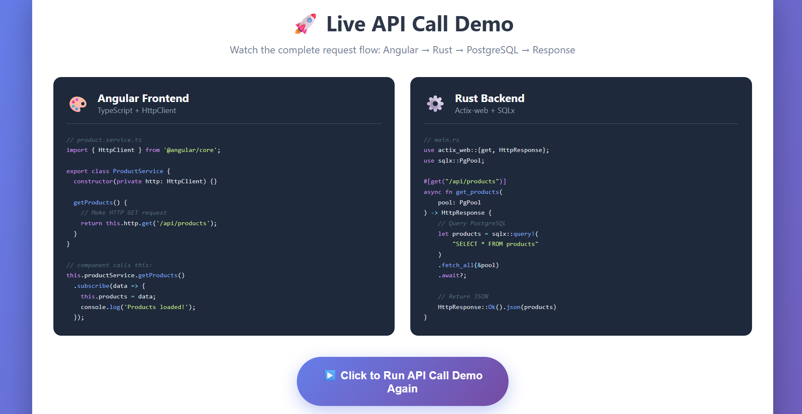

# Modern Web Architecture: Angular + Rust + PostgreSQL

## Assignment Overview
This document explains the architecture of modern web applications using Angular for the frontend, Rust for the backend, and PostgreSQL for data storage.

## 1. What Angular Components Do

Components are the building blocks of Angular applications. Each component represents a self-contained piece of the user interface.

**Key Responsibilities:**
- Display data to users
- Capture user input (clicks, form entries)
- Render HTML templates
- Execute presentation logic
- Communicate with services for data

**Component Structure:**
- **Template**: The HTML structure (what users see)
- **Class**: TypeScript code with logic and data
- **Styles**: CSS for appearance
- **Metadata**: Configuration using @Component decorator

**Example Use Cases:**
- Product listing component
- Navigation bar component
- User profile component
- Shopping cart component

**Why Components Matter:**
- Reusable across the application
- Easy to test independently
- Maintainable and organized code
- Clear separation of concerns

---

## 2. What Angular Services Do

Services handle business logic and data operations that don't belong in components.

**Primary Functions:**
- Make HTTP requests to backend APIs
- Share data between multiple components
- Perform calculations and data transformations
- Manage application state
- Handle authentication and authorization

**Why Services Are Important:**
- Keep components focused on UI logic
- Enable code reuse across components
- Provide a single source of truth for data
- Make testing easier (can mock services)

**Service Pattern:**
```typescript
@Injectable({
  providedIn: 'root'
})
export class ProductService {
  constructor(private http: HttpClient) {}
  
  getProducts() {
    return this.http.get('/api/products');
  }
}
```

---

## 3. How HttpClient Sends Requests

HttpClient is Angular's built-in module for making HTTP requests to backend APIs.

**Request Process:**

1. **Import HttpClient Module**
   - Add HttpClientModule to your app
   - Inject HttpClient into your service

2. **Make HTTP Calls**
   - GET: Retrieve data
   - POST: Create new data
   - PUT: Update existing data
   - DELETE: Remove data

3. **Handle Responses**
   - Subscribe to Observable
   - Process returned data
   - Handle errors gracefully

**Example Flow:**
```typescript
// In your service
getProducts(): Observable {
  return this.http.get('/api/products');
}

// In your component
ngOnInit() {
  this.productService.getProducts().subscribe({
    next: (data) => this.products = data,
    error: (error) => console.error('Error:', error)
  });
}
```

**Key Features:**
- Returns Observables (RxJS)
- Supports request/response interception
- Automatic JSON parsing
- Built-in error handling
- Type-safe with TypeScript generics

---

## 4. What Rust APIs Do

Rust APIs serve as the backend server, handling business logic and database operations.

**Built With:**
- **Actix-web**: High-performance web framework
- **Axum**: Modern, ergonomic web framework
- Both are async and extremely fast

**Core Responsibilities:**

1. **Request Handling**
   - Receive HTTP requests from frontend
   - Parse request body and parameters
   - Validate input data

2. **Business Logic**
   - Execute application rules
   - Perform calculations
   - Validate business constraints

3. **Authentication & Authorization**
   - Verify user identity
   - Check permissions
   - Generate and validate tokens

4. **Database Operations**
   - Query data using SQLx/SeaORM
   - Insert, update, delete records
   - Handle transactions

5. **Response Generation**
   - Format data as JSON
   - Set appropriate status codes
   - Return data to frontend

**Why Rust for Backend?**

1. **Performance**
   - Near C++ speeds
   - Efficient memory usage
   - Handles thousands of concurrent connections

2. **Memory Safety**
   - No null pointer errors
   - No buffer overflows
   - No data races

3. **Type Safety**
   - Compile-time error detection
   - Strong type system
   - Pattern matching for error handling

4. **Reliability**
   - If it compiles, it usually works
   - Fewer runtime crashes
   - Predictable behavior

**Example Rust API Handler:**
```rust
async fn get_products(pool: web::Data) -> Result {
    let products = sqlx::query_as!(Product, "SELECT * FROM products")
        .fetch_all(pool.get_ref())
        .await?;
    
    Ok(HttpResponse::Ok().json(products))
}
```

---

## 5. How PostgreSQL Fits Into the Flow

PostgreSQL is the relational database that stores all application data persistently.

**Role in the Architecture:**

1. **Data Storage**
   - Stores user accounts
   - Stores products, orders, transactions
   - Maintains relationships between data
   - Preserves data even if server restarts

2. **Data Integrity**
   - ACID compliance (Atomicity, Consistency, Isolation, Durability)
   - Foreign key constraints
   - Check constraints
   - Transaction support

3. **Query Performance**
   - Indexing for fast searches
   - Query optimization
   - Efficient joins across tables

4. **Concurrent Access**
   - Multiple users can access simultaneously
   - Transaction isolation prevents conflicts
   - Row-level locking

**How Rust Connects to PostgreSQL:**

**Option 1: SQLx (Type-Safe SQL)**
```rust
let products = sqlx::query!("SELECT id, name, price FROM products")
    .fetch_all(&pool)
    .await?;
```
- Validates SQL at compile time
- Checks against actual database schema
- Returns strongly-typed results

**Option 2: SeaORM (Object-Relational Mapping)**
```rust
let products = Product::find()
    .filter(product::Column::InStock.eq(true))
    .all(&db)
    .await?;
```
- Work with Rust structs instead of SQL
- Type-safe query building
- Automatic migrations

**Why PostgreSQL?**
- Industry-standard reliability
- Supports complex queries
- Excellent performance
- Rich feature set (JSON, full-text search, geospatial)
- Strong community and tooling

---

## 6. Full Request Cycle Diagram

### Architecture Layers
┌─────────────────────────────────────────────────────┐
│                    USER BROWSER                      │
│                  (Client Device)                     │
└────────────────────┬────────────────────────────────┘
│
↓
┌─────────────────────────────────────────────────────┐
│              ANGULAR FRONTEND                        │
│  ┌─────────────────────────────────────────────┐   │
│  │         Component (UI Layer)                 │   │
│  │  - Displays data                            │   │
│  │  - Captures user interactions               │   │
│  │  - Binds to templates                       │   │
│  └─────────────────┬───────────────────────────┘   │
│                     ↓                                │
│  ┌─────────────────────────────────────────────┐   │
│  │         Service Layer                        │   │
│  │  - Business logic                           │   │
│  │  - HttpClient calls                         │   │
│  │  - Data transformation                      │   │
│  └─────────────────┬───────────────────────────┘   │
└────────────────────┼────────────────────────────────┘
│
↓ HTTP Request (JSON)
│
┌────────────────────┼────────────────────────────────┐
│              RUST BACKEND API                        │
│  ┌─────────────────┴───────────────────────────┐   │
│  │      HTTP Handler (Actix/Axum)              │   │
│  │  - Route matching                           │   │
│  │  - Request parsing                          │   │
│  │  - Authentication check                     │   │
│  └─────────────────┬───────────────────────────┘   │
│                     ↓                                │
│  ┌─────────────────────────────────────────────┐   │
│  │         Business Logic Layer                 │   │
│  │  - Validation                               │   │
│  │  - Rules enforcement                        │   │
│  │  - Calculations                             │   │
│  └─────────────────┬───────────────────────────┘   │
│                     ↓                                │
│  ┌─────────────────────────────────────────────┐   │
│  │      Database Access (SQLx/SeaORM)          │   │
│  │  - SQL query generation                     │   │
│  │  - Type-safe queries                        │   │
│  │  - Connection pooling                       │   │
│  └─────────────────┬───────────────────────────┘   │
└────────────────────┼────────────────────────────────┘
│
↓ SQL Query
│
┌────────────────────┼────────────────────────────────┐
│                POSTGRESQL DATABASE                   │
│  ┌─────────────────┴───────────────────────────┐   │
│  │          Data Tables                         │   │
│  │  - users, products, orders, etc.            │   │
│  │  - Indexes for fast queries                 │   │
│  │  - Foreign key relationships                │   │
│  └─────────────────┬───────────────────────────┘   │
│                     ↓                                │
│  ┌─────────────────────────────────────────────┐   │
│  │        Query Processor                       │   │
│  │  - Executes SQL                             │   │
│  │  - Returns result sets                      │   │
│  │  - Ensures ACID compliance                  │   │
│  └─────────────────────────────────────────────┘   │
└─────────────────────────────────────────────────────┘

### Detailed Request Flow: "View Products" Example

**Step 1:** User clicks "View Products" button
- Browser event fires
- Angular component's click handler is triggered

**Step 2:** Component calls service method
```typescript
this.productService.getProducts()
```

**Step 3:** Service makes HTTP request
```typescript
return this.http.get<Product[]>('/api/products')
```

**Step 4:** HTTP GET request sent
- URL: http://localhost:8080/api/products
- Headers: Authorization, Content-Type
- Method: GET

**Step 5:** Rust API receives request
```rust
#[get("/api/products")]
async fn get_products() -> Result<HttpResponse>
```

**Step 6:** Rust validates authentication
- Checks JWT token
- Verifies user permissions
- Logs request

**Step 7:** Rust queries database via SQLx
```rust
let products = sqlx::query_as!(Product, 
    "SELECT id, name, price, description FROM products WHERE active = $1",
    true
)
.fetch_all(&pool)
.await?;
```

**Step 8:** PostgreSQL processes query
- Parses SQL
- Uses indexes to find matching rows
- Returns result set

**Step 9:** Database returns data to Rust
[
{id: 1, name: "Laptop", price: 999.99, description: "High-performance laptop"},
{id: 2, name: "Mouse", price: 29.99, description: "Wireless mouse"}
]

**Step 10:** Rust formats JSON response
```rust
Ok(HttpResponse::Ok().json(products))
```

**Step 11:** HTTP response sent to Angular
```json
{
  "status": 200,
  "body": [
    {"id": 1, "name": "Laptop", "price": 999.99},
    {"id": 2, "name": "Mouse", "price": 29.99}
  ]
}
```

**Step 12:** Angular service receives response
- Observable emits data
- Service returns to component

**Step 13:** Component updates
```typescript
this.products = data;
```

**Step 14:** Angular's change detection runs
- Template re-renders
- User sees products on screen

**Total Time:** 50-200ms depending on network and database

---

## 7. Why Type-Safe Systems Matter

### The Problem Without Type Safety

Imagine building a shopping cart without type safety:

**JavaScript/Loose Typing:**
```javascript
function calculateTotal(items) {
  let total = 0;
  items.forEach(item => {
    total += item.price; // What if price is undefined?
  });
  return total;
}

// This compiles fine but crashes at runtime:
calculateTotal([{name: "Laptop"}]); // price is undefined!
```

**Consequences:**
- Runtime errors in production
- Users see broken pages
- Lost sales and trust
- Difficult to debug

### The Solution: Type Safety Across the Stack

**TypeScript (Frontend):**
```typescript
interface Product {
  id: number;
  name: string;
  price: number;
}

function calculateTotal(items: Product[]): number {
  // Compiler ensures price exists and is a number
  return items.reduce((sum, item) => sum + item.price, 0);
}

// This won't compile - caught before running:
calculateTotal([{name: "Laptop"}]); // Error: Property 'price' is missing!
```

**Rust (Backend):**
```rust
struct Product {
    id: i32,
    name: String,
    price: f64,
}

fn calculate_total(items: &[Product]) -> f64 {
    items.iter().map(|item| item.price).sum()
}

// Won't compile if Product doesn't have price field
```

**SQLx (Database):**
```rust
// This query is checked against your actual database at compile time:
let products = sqlx::query!("SELECT id, name, price FROM products")
    .fetch_all(&pool)
    .await?;

// If 'products' table doesn't exist → Compile error
// If 'price' column doesn't exist → Compile error
// If you try to access a non-existent field → Compile error
```

### Benefits of Full-Stack Type Safety

1. **Catch Errors Early**
   - Before code runs
   - During development
   - In your IDE with red squiggles

2. **Better Developer Experience**
   - Auto-completion works perfectly
   - Refactoring is safe
   - Documentation is built-in

3. **Fewer Bugs in Production**
   - No "undefined is not a function"
   - No null pointer exceptions
   - No SQL syntax errors

4. **Confidence When Making Changes**
   - Compiler tells you what breaks
   - Can't forget to update related code
   - Smooth refactoring

5. **Easier Onboarding**
   - New developers can read type signatures
   - Clear contracts between components
   - Self-documenting code

---

## 8. Real-World Applications of This Stack

Companies using Angular + Rust + PostgreSQL (or similar stacks):

- **Discord**: Uses Rust for performance-critical services
- **Cloudflare**: Rust for edge computing
- **Dropbox**: Rust for file synchronization
- **AWS**: Firecracker (virtualization) in Rust
- **Microsoft**: Parts of Azure in Rust

**Use Cases:**
- E-commerce platforms
- Admin dashboards
- Internal business tools
- Real-time analytics
- Financial applications
- Healthcare systems
- Content management systems

---

## 9. Summary & Key Takeaways

This architecture provides:

✅ **Fast Performance**: Rust's speed + PostgreSQL's optimization  
✅ **Type Safety**: Errors caught at compile time across entire stack  
✅ **Scalability**: Handle millions of users  
✅ **Reliability**: Memory-safe code, ACID-compliant data  
✅ **Developer Experience**: Auto-completion, refactoring support  
✅ **Security**: Rust prevents common vulnerabilities  
✅ **Maintainability**: Clear separation of concerns  

**The Request Flow** (memorize this):
1. User → 2. Component → 3. Service → 4. HTTP → 5. Rust API → 6. Business Logic → 7. Database Query → 8. PostgreSQL → 9. Response → 10. Service → 11. Component → 12. UI Update

---

## 10. References & Further Learning

- [Angular Documentation](https://angular.io/docs)
- [Rust Book](https://doc.rust-lang.org/book/)
- [Actix Web](https://actix.rs/)
- [SQLx Documentation](https://github.com/launchbadge/sqlx)
- [PostgreSQL Tutorial](https://www.postgresql.org/docs/)

---

## Screenshot



*Full system architecture showing Angular frontend, Rust backend, and PostgreSQL database with request flow*

echo "PR created for Assignment 3.3 submission" >> README.md
